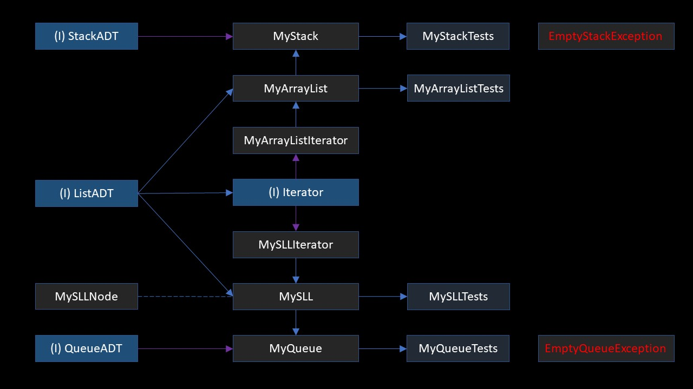
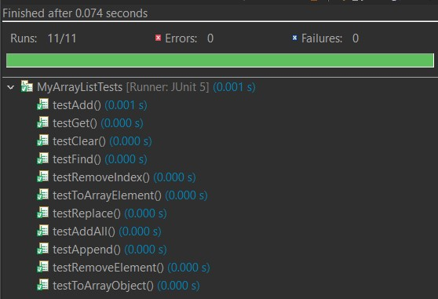
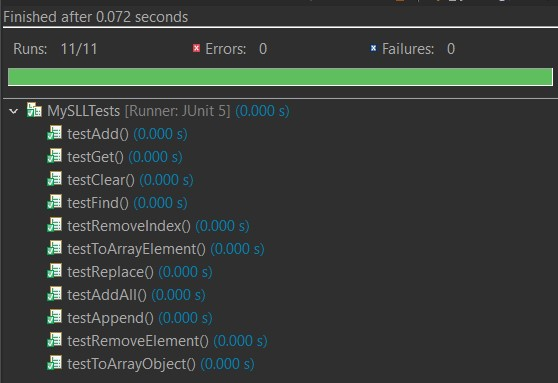
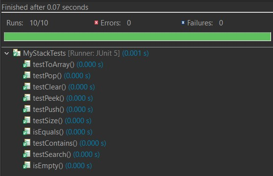
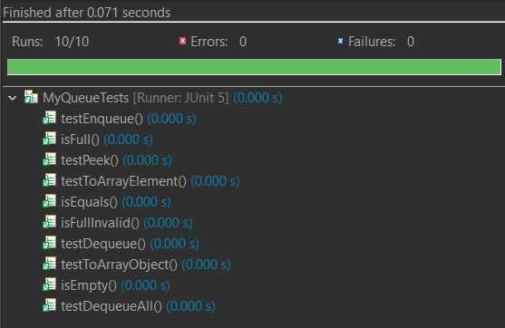

<h1 align="center">Welcome to XML Parser 👋</h1>

## What project is it?

> This is XML Parser, a project I did in the third semester of college <a href="https://www.sait.ca/programs-and-courses/diplomas/information-technology" target='_blank'>(SAIT)</a>.

## What is the purpose of the project?

> This application is parsing XML files with my own Abstract Data Types (ADT) for a stack and a queue. There are utility classes used to implement the XML parser, which reads and confirms that the XML files are properly formatted.

## What is XML?

> Extensible Markup Language (XML) is a markup language that defines a set of rules for encoding documents in a format that is both human-readable and machine-readable.
> <a href="https://en.wikipedia.org/wiki/XML" target=" _blank">Learn more on Wikipedia</a>

## Languages

   

## Structure of the program

## Testing

> Result of the JUnit Test

